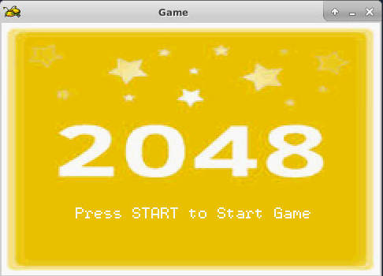
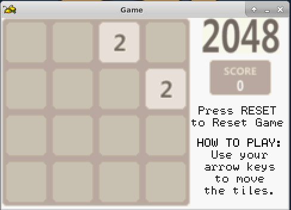
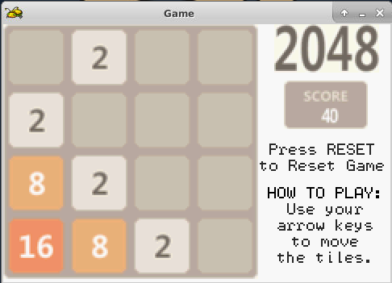
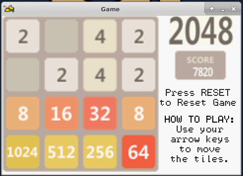
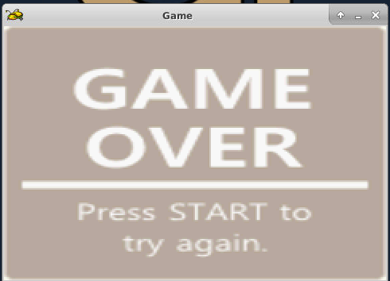

# GBA-2048-GAME
========================
#### Author: Kiet Tran

## Welcome to my 2048 GBA game!

## Description: 
2048 is a single player sliding block puzzle game designed by Italian web developer Gabriele Cirulli. The game's objective is to slide numbered tiles on a grid to combine them to create a tile with the number 2048.

## Instruction:
Use your arrow keys to move the tiles. When two tiles with the same number touch, they merge into one and you get points for that! In this attempt, try to get a block of 2048 and you win the game!

### Note: 
If there is no avalable move, you lose :(   

### Hint: 
Use RESET button to Reset Game

### Commands:

GameBoy | Keyboard
--------|----------
  Start | Enter
  Reset | Backspace
   Left | Left Arrow
  Right | Right Arrow
  Up    | Up Arrow
  Down  | Down Arrow
   
   
## Screenshots:

